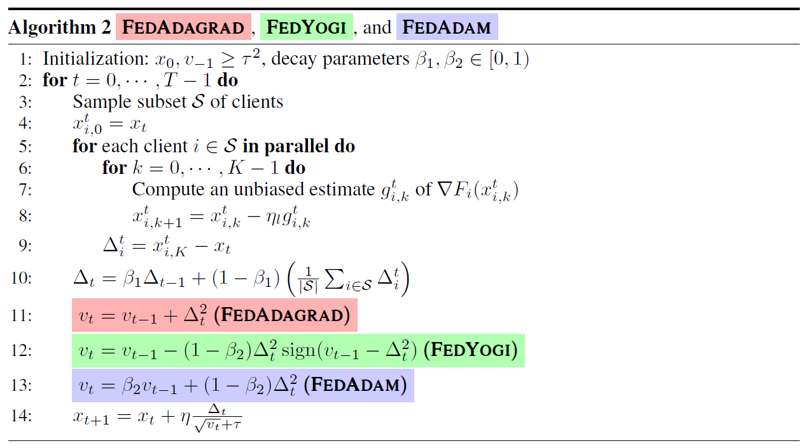

# Adaptive Federated Optimization

**conference: ICLR**  
**year: 2021**  
**link: [paper](https://openreview.net/pdf?id=LkFG3lB13U5)**

## 1. What kind of research

- The paper presents research on federated learning (FL), specifically focusing on developing adaptive federated optimization methods. These methods aim to improve the training performance and convergence rates in FL settings, where data is distributed across multiple clients and direct access to the data is restricted due to privacy concerns.

## 2. What makes it great compared to previous studies

- This research is significant as it introduces adaptive optimization techniques to FL, which were traditionally used in centralized machine learning. By doing so, the paper addresses key challenges in FL such as handling client heterogeneity, reducing communication costs, and improving convergence rates.
- The methods proposed are evaluated on a diverse and representative suite of federated datasets and tasks, showcasing their robustness and effectiveness.

## 3. Key points of the technique or method

- **Adaptive Federated Optimization Algorithms:** The paper proposes several adaptive optimization algorithms, including FedAdagrad, FedAdam, and FedYogi. These algorithms adapt the learning rates based on the server's updates, enhancing convergence.

- **Hyperparameter Tuning:** Extensive hyperparameter tuning is performed to identify the best client and server learning rate combinations for different tasks.
- **Handling Client Heterogeneity:** The methods incorporate strategies to mitigate the impact of client heterogeneity, which is a common challenge in FL.

## 4. How it was validated

- The proposed methods were validated through extensive experimental evaluation on five datasets (CIFAR-10, CIFAR-100, EMNIST, Shakespeare, and Stack Overflow) and seven learning tasks. The experiments compared the performance of the adaptive optimization algorithms against baseline methods like FedAvg and SCAFFOLD. Metrics such as validation accuracy, test set performance, and communication efficiency were used to assess the effectiveness of the proposed methods.

## 5. Discussion

- The paper discusses the advantages of using adaptive optimization in federated settings, highlighting improvements in convergence rates and communication efficiency. It also addresses the trade-offs involved, such as the potential increase in computation on the server side.
- The authors emphasize the importance of tuning hyperparameters and the impact of client heterogeneity on the performance of FL algorithms.

## 6. Which paper to read next

## 7. Notes

- The paper provides detailed appendices that include hyperparameter grids, experimental setups, and additional results, which are valuable resources for researchers looking to replicate or build upon this work.
