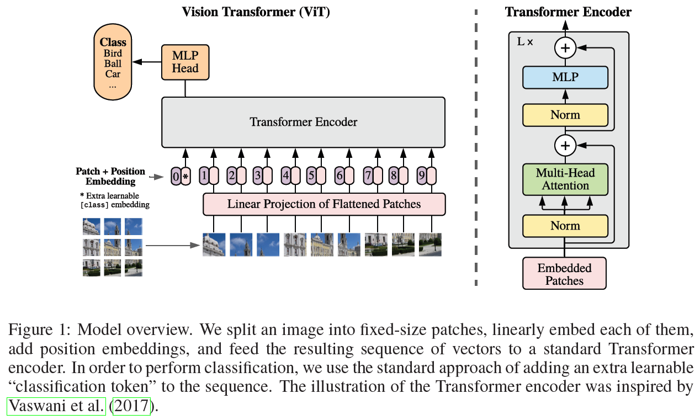

# An Image Is Worth 16x16 Words Transformers for Image Recognition at Scale

**conference: ICLR**  
**year: 2021**  
**link: [paper](https://openreview.net/pdf?id=YicbFdNTTy)**

## 1. What kind of research

- This paper presents research in the field of computer vision, specifically focusing on the application of Transformer models to image recognition tasks. The authors introduce a novel model called Vision Transformer (ViT), which applies the Transformer architecture directly to sequences of image patches

## 2. What makes it great compared to previous studies

- This study is groundbreaking because it demonstrates that Transformers can be applied directly to sequences of image patches, without requiring a convolutional neural network (CNN).
- The authors show that this approach can achieve competitive performance on image classification benchmarks, even surpassing state-of-the-art CNN models under certain conditions.

## 3. Key points of the technique or method

- **Transformer Architecture**: ViT model splits images into patches and processes these patches as sequences, similar to how words are processed in NLP tasks.
- **Patch Embedding**: Each image is divided into fixed-size patches (e.g., 16x16 pixels), which are then linearly embedded into a sequence of vectors.
- **Training on Large Datasets**: The effectiveness of ViT is demonstrated when it is pre-trained on large-scale datasets, such as JFT-300M, before being fine-tuned on smaller datasets.

## 4. How it was validated

- The model was validated through extensive experiments comparing its performance to state-of-the-art CNNs on various image recognition benchmarks. ViT was pre-trained on large datasets and then fine-tuned on standard datasets like ImageNet. The results showed that ViT outperformed traditional CNNs, especially as the dataset size increased.

## 5. Discussion

- The discussion in the paper emphasizes the potential of Transformer-based models in computer vision, particularly when large-scale data is available.
- The authors highlight that ViT models benefit significantly from pre-training on massive datasets, which might limit their applicability in scenarios with limited data.

## 6. Which paper to read next

## 7. Notes

- ViT code is available at [GitHub](https://github.com/google-research/vision_transformer).
- AxialResNet code is available at [GitHub](https://github.com/csrhddlam/axial-deeplab).
