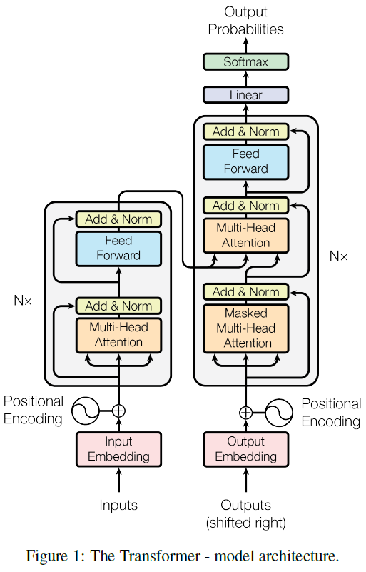
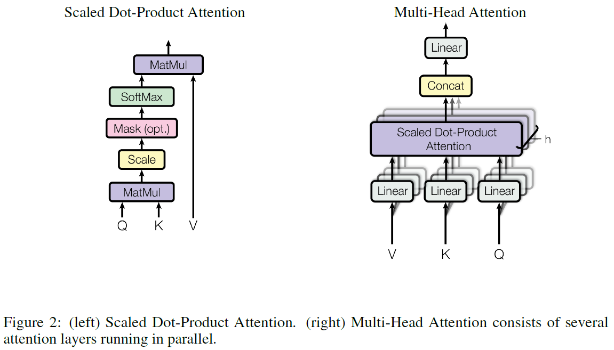

# Attention Is All You Need

**conference: NeurIPS**  
**year: 2017**  
**link: [paper](https://papers.nips.cc/paper_files/paper/2017/file/3f5ee243547dee91fbd053c1c4a845aa-Paper.pdf)**

## 1. What kind of research

- This paper introduces a novel neural network architecture called the Transformer, which is designed to handle sequence-to-sequence tasks, such as machine translation, without relying on traditional recurrent neural networks (RNNs) or convolutional neural networks (CNNs).

## 2. What makes it great compared to previous studies

- The Transformer model is groundbreaking because it eliminates the need for recurrence, making it significantly more parallelizable and faster in training than previous models like RNNs and LSTMs. Its architecture relies entirely on self-attention mechanisms, allowing it to capture long-range dependencies in sequences more effectively. This advancement leads to better performance on tasks such as translation and makes the model highly scalable to larger datasets and longer sequences.

## 3. Key points of the technique or method

- **Self-Attention Mechanism**: The core innovation is the use of self-attention, which allows the model to weigh the importance of different words in a sequence relative to each other, enabling better context understanding.
- **Positional Encoding**: Since the Transformer does not have a sequential structure like RNNs, it uses positional encoding to maintain the order of the sequence.
- **Multi-Head Attention**: This technique allows the model to focus on different parts of the sequence simultaneously, improving its ability to understand context.
- **Layer Stacking**: The Transformer model stacks multiple layers of attention and feed-forward networks to build deep representations of the input and output sequences.

## 4. How it was validated

- The model was validated through extensive experiments on translation tasks, specifically on the WMT 2014 English-to-German and English-to-French datasets. The Transformer achieved state-of-the-art results, outperforming previous models such as LSTMs with attention mechanisms.

## 5. Discussion

- The discussion in the paper highlights the efficiency and scalability of the Transformer model. It emphasizes how the architecture can be extended to other tasks beyond translation, such as text summarization and language modeling.
- The paper also addresses the challenges of training deep networks and suggests that the Transformer’s self-attention mechanism makes it easier to train and adapt to various tasks compared to RNNs and CNNs.

## 6. Which paper to read next

## 7. Notes

- The code to train and evaluate models is available at [GitHub](https://github.com/tensorflow/tensor2tensor).
