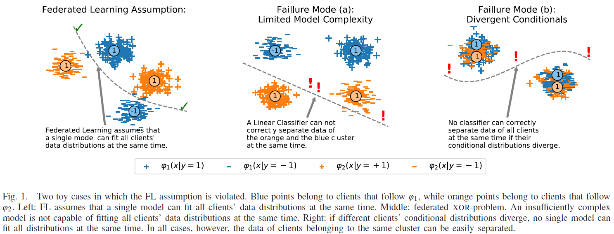
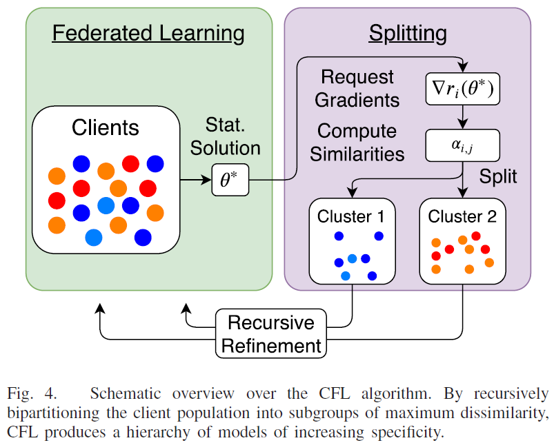

# Clustered Federated Learning: Model-Agnostic Distributed Multitask Optimization Under Privacy Constraints

**conference: IEEE**  
**year: 2021**  
**link: [paper](https://ieeexplore.ieee.org/stamp/stamp.jsp?arnumber=9174890)**

## 1. What kind of research

- This paper presents a theoretical and experimental study on Federated Learning (FL), specifically addressing the limitations of traditional FL when dealing with non-iid data distributions among clients.
- The research introduces a novel Federated Multi-Task Learning (FMTL) framework called Clustered Federated Learning (CFL).

## 2. What makes it great compared to previous studies

- CFL addresses the issue of suboptimal performance in FL when clients' data distributions diverge. Unlike previous FMTL approaches, CFL does not require modifications to the FL communication protocol and can handle general non-convex objectives, including deep neural networks.

- Additionally, it comes with strong mathematical guarantees on clustering quality and can manage client populations that change over time.

## 3. Key points of the technique or method

- **Geometric Properties Utilization:** CFL exploits geometric properties of the FL loss surface to cluster clients with similar data distributions.
- **Model-Agnostic:** The framework is applicable to any model type, including deep neural networks.
- **Post-Processing Method:** Clustering is performed after FL converges to a stationary point, enhancing performance by allowing clients to develop more specialized models.
- **Privacy-Preserving:** CFL maintains the privacy constraints inherent in FL, ensuring client data remains private.

## 4. How it was validated

- Theoretical analysis: Mathematical proofs and derivations are provided to support the clustering methodology and guarantees.
- Experimental validation: Extensive experiments using deep convolutional and recurrent neural networks on commonly used FL datasets demonstrate the effectiveness of CFL in improving model performance under various conditions.

## 5. Discussion

- The paper discusses the inherent assumptions in traditional FL, particularly the assumption that a single model can fit all clients' data distributions. It highlights scenarios where this assumption fails and demonstrates how CFL can effectively address these issues by clustering clients into groups with congruent data distributions.
- The discussion also covers the flexibility of CFL in handling dynamic client populations and its robustness in maintaining privacy.

## 6. Which paper to read next

- ["Federated Multi-Task Learning" by Smith et al. (2017)](https://proceedings.neurips.cc/paper_files/paper/2017/file/6211080fa89981f66b1a0c9d55c61d0f-Paper.pdf)

## 7. Notes

- The research emphasizes the practical relevance of CFL in real-world FL applications where client data is highly heterogeneous. By introducing a flexible and robust clustering method, CFL enhances the adaptability and effectiveness of FL systems.
- The paper also underscores the importance of maintaining privacy while achieving superior model performance across diverse client populations.
