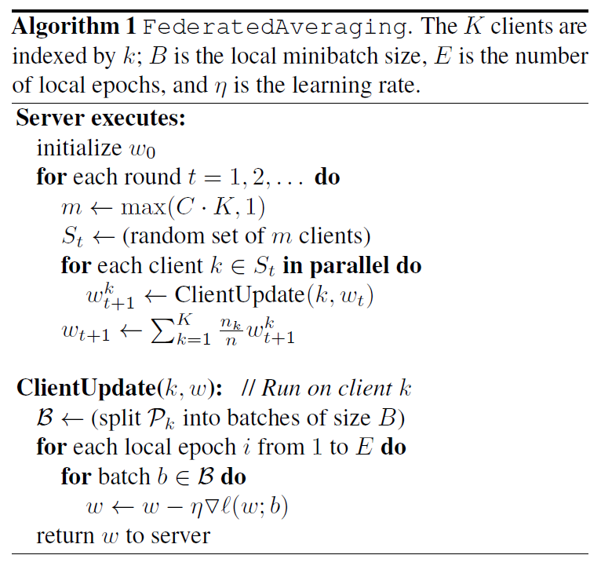

# Communication-Efficient Learning of Deep Networks from Decentralized Data

**conference: AISTATS**  
**year: 2017**  
**link: [paper](https://proceedings.mlr.press/v54/mcmahan17a/mcmahan17a.pdf)**

## 1. What kind of research

- The paper presents research on a decentralized approach to training deep learning models, specifically termed Federated Learning (FL). This method allows models to be trained across multiple decentralized devices holding local data samples, without sharing the actual data.

## 2. What makes it great compared to previous studies

- Unlike traditional centralized learning methods, FL ensures data privacy by keeping data on the local devices. It reduces communication costs significantly (by 10-100×) compared to synchronized stochastic gradient descent methods.
- The paper's approach is robust to non-IID (non-independent and identically distributed) and unbalanced data distributions, which are common in real-world decentralized data.

## 3. Key points of the technique or method

- **FL Approach**: Each client computes updates to a shared model locally and only the updates are sent to a central server for aggregation, rather than sharing raw data.
- **Federated Averaging (FedAvg)**: Combines local stochastic gradient descent on each client with model averaging by a central server.

- **Optimization**: The algorithm handles non-IID, unbalanced, and massively distributed data with limited communication capabilities.
- **Privacy**: The method inherently offers privacy benefits as it minimizes the sharing of sensitive raw data and focuses on transmitting model updates.

## 4. How it was validated

- The approach was validated through extensive empirical evaluations using five different model architectures and four datasets.
- The experiments demonstrated the method's robustness to non-IID and unbalanced data distributions.
- Communication costs were evaluated, showing a significant reduction in communication rounds compared to traditional methods.

## 5. Discussion

- The paper discusses the potential of FL to improve privacy and security by limiting data exposure to only the device rather than both the device and the cloud.
- It also addresses practical issues such as client availability, data changes, and the challenges of non-IID and unbalanced data.
- The authors suggest future work in integrating FL with secure multiparty computation and differential privacy to further enhance privacy guarantees.

## 6. Which paper to read next

- [“Privacy-Preserving Deep Learning” by Shokri and Shmatikov (2015)](https://dl.acm.org/doi/pdf/10.1145/2810103.2813687)

## 7. Notes

- FL is especially useful for applications involving sensitive user data on mobile devices, like language models for text input and image classification.
- The method's reliance on iterative model averaging helps mitigate the communication bottleneck inherent in decentralized learning scenarios.
- The approach is aligned with privacy principles such as data minimization and focused collection.
