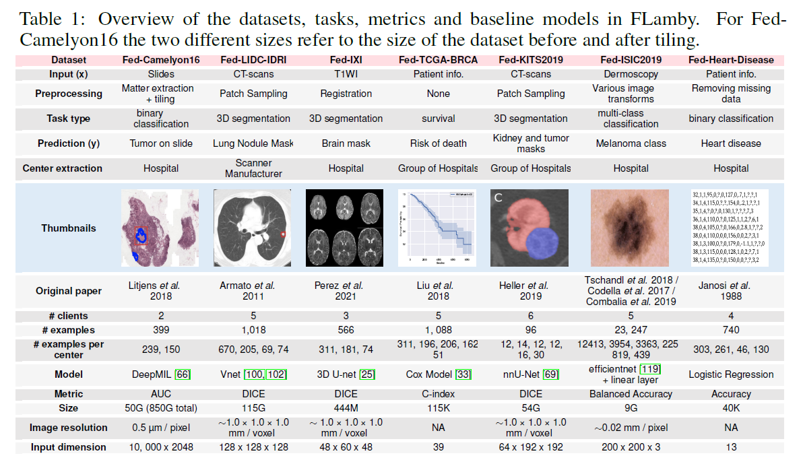
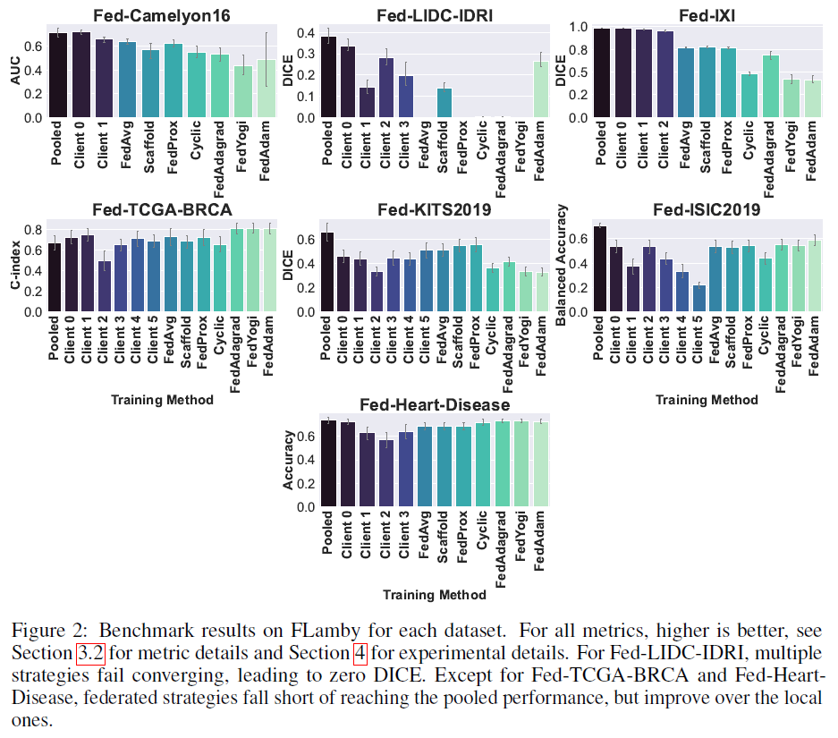

# FLamby: Datasets and Benchmarks for Cross-Silo Federated Learning in Realistic Healthcare Settings

**conference: NeurIPS**  
**year: 2022**  
**link: [paper](https://proceedings.neurips.cc/paper_files/paper/2022/file/232eee8ef411a0a316efa298d7be3c2b-Paper-Datasets_and_Benchmarks.pdf)**

## 1. What kind of research

- This paper presents research on cross-silo federated learning (FL) in healthcare. It focuses on developing and benchmarking FL datasets and methods to address realistic healthcare settings, where data is siloed across multiple institutions.

## 2. What makes it great compared to previous studies

- This study stands out because it provides a comprehensive suite of realistic healthcare datasets, Federated Learning AMple Benchmark of Your cross-silo strategies (FLamby), specifically designed for cross-silo FL.
- Unlike previous studies that often rely on artificially partitioned datasets, FLamby includes naturally partitioned, real-world datasets, enhancing the realism and relevance of FL evaluations.

## 3. Key points of the technique or method

- **Dataset Suite**: FLamby includes a variety of healthcare datasets that are partitioned according to natural data distribution among different clients (e.g., hospitals).

- **Benchmarking Framework**: The study introduces a detailed benchmarking framework for evaluating different FL strategies on these datasets. It includes guidelines for train/test splits, hyperparameter tuning, and performance evaluation.
- **Reproducibility**: The framework is designed to be reproducible, providing scripts and configuration files to replicate the benchmarks easily.

## 4. How it was validated

- The methods were validated through extensive experiments on the provided datasets. Various FL strategies, including FedAvg, SCAFFOLD, FedProx, and others, were benchmarked and their performance was evaluated using appropriate metrics such as AUC and DICE for different datasets.
- The results were averaged across different local clients to ensure robustness. Additionally, the paper details the computational resources used and includes instructions for reproducing the experiments.

## 5. Discussion

- The discussion emphasizes the importance of realistic data heterogeneity in evaluating FL strategies. It highlights the challenges posed by unbalanced and non-IID (Independent and Identically Distributed) data distributions that are common in real-world FL scenarios.
- The paper also discusses the potential of FLamby to facilitate the development of more effective and generalizable FL methods by providing a realistic evaluation environment.

## 6. Which paper to read next

- [“Siloed Federated Learning for Multi-Centric Histopathology Datasets" by Andreux et al. (2020)](https://arxiv.org/pdf/2008.07424)

## 7. Notes

- The FLamby code is available at [GitHub](https://github.com/owkin/flamby).
