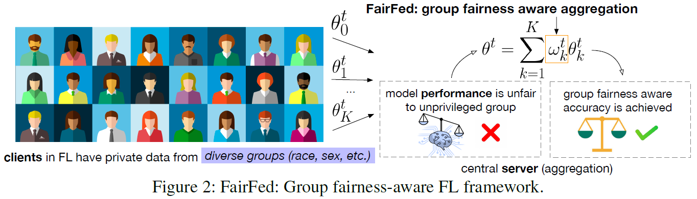

# FairFed: Enabling Group Fairness in Federated Learning

**conference: AAAI**  
**year: 2023**  
**link: [paper](https://ojs.aaai.org/index.php/AAAI/article/view/25911/25683)**

## 1. What kind of research

- The paper presents a study on federated learning (FL), focusing on enhancing group fairness across distributed data sources. The research aims to develop techniques to ensure fair treatment of different demographic groups within the FL framework.

## 2. What makes it great compared to previous studies

- Unlike prior studies that predominantly address fairness in centralized settings, this work extends fairness considerations to the FL paradigm. This approach is significant because it allows for the inclusion of diverse datasets from multiple sources while maintaining fairness, privacy, and data locality.

## 3. Key points of the technique or method

- **Secure Aggregation:** FairFed uses secure aggregation to compute global fairness metrics without revealing individual client data.
- **Global Fairness Computation:** It aggregates local fairness metrics from clients to compute a global fairness metric, ensuring fair model performance across groups.
- **Fairness Budget:** Introduces a fairness budget parameter (β) that controls the impact of fairness on model aggregation weights, allowing a trade-off between fairness and accuracy.
- **Flexibility:** FairFed can work with various local debiasing methods, making it adaptable to different scenarios and datasets.

## 4. How it was validated

- The effectiveness of FairFed was validated through extensive experiments using well-known datasets (Adult and COMPAS). The researchers evaluated its performance under different levels of data heterogeneity across clients. They compared FairFed's performance with several baseline methods and measured the trade-off between fairness and accuracy.
- Additional experiments were conducted to assess FairFed's performance with different local debiasing techniques and fairness budgets

## 5. Discussion

- The results demonstrated that FairFed significantly improves group fairness under various data heterogeneity settings compared to local debiasing methods. The gains in fairness are achieved with minimal loss in accuracy.
- The paper discusses the limitations of FairFed in homogeneous data distributions, where local debiasing methods might suffice. It also emphasizes the importance of selecting appropriate fairness budgets and local debiasing techniques to optimize performance.

## 6. Which paper to read next

- ["Practical Secure Aggregation for Privacy-Preserving Machine Learning" by Bonawitz et al. (2017)](https://dl.acm.org/doi/pdf/10.1145/3133956.3133982)
- ["Measuring the Effects of Non-Identical Data Distribution for Federated Visual Classification" by Hsu, Qi, and Brown (2019)](https://arxiv.org/pdf/1909.06335)
- ["FairBatch: Batch Selection for Model Fairness" by Roh et al. (2021)](https://openreview.net/pdf?id=YNnpaAKeCfx)

## 7. Notes

- FairFed uses the FedML library for implementation, highlighting the practical aspects of deploying FL algorithms.
- The research underscores the importance of secure aggregation in maintaining privacy while achieving global fairness objectives.
- The configurable data synthesis method for sensitive attributes provides a robust mechanism to evaluate fairness under diverse scenarios.
