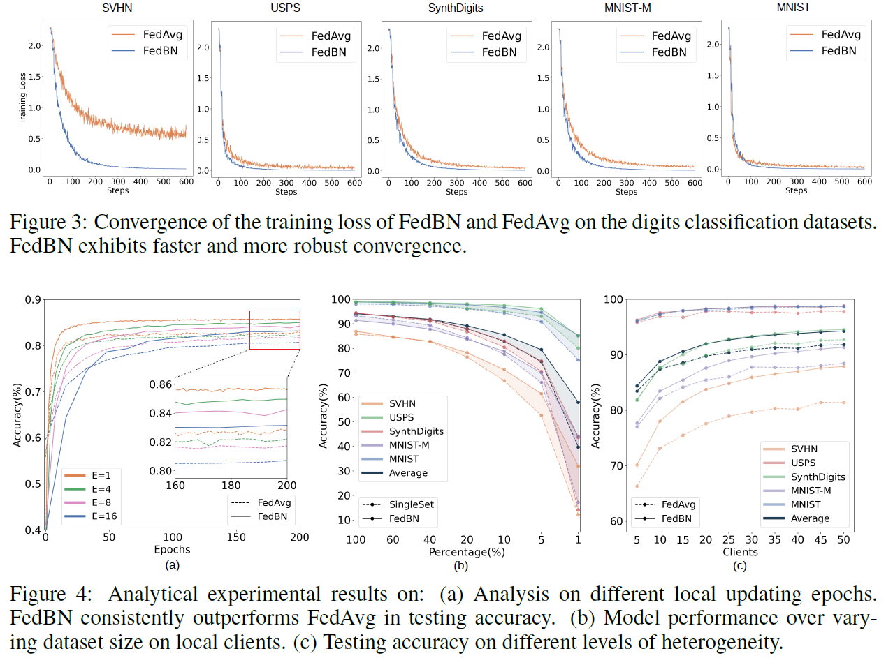

# FedBN: Federated Learning on Non-IID Features via Local Batch Normalization

**conference: ICLR**  
**year: 2021**  
**link: [paper](https://openreview.net/pdf?id=6YEQUn0QICG)**

## 1. What kind of research

- This research focuses on federated learning (FL), specifically addressing the challenges posed by non-independent and identically distributed (non-IID) features across clients.
- The proposed solution, FedBN, introduces local batch normalization to improve model performance in FL setups with feature shift.

## 2. What makes it great compared to previous studies

- Unlike previous studies that primarily dealt with label distribution skew or client drift, this work tackles feature shift non-IID scenarios, where local data distributions vary significantly due to differences in data sources, such as different medical imaging devices or varied scenery in autonomous driving.
- The introduction of local batch normalization in the FL context is novel and shows superior performance over existing methods like FedAvg and FedProx.

## 3. Key points of the technique or method

- **Local Batch Normalization:** Each client maintains its own batch normalization (BN) parameters, which are not communicated or averaged with the server. This approach helps harmonize local feature distributions, making the FL process more robust to feature shifts.
- **FedAvg Integration:** The method integrates with the existing FedAvg algorithm, updating only the non-BN layers in the averaging process, thereby requiring no additional parameters or significant computational resources.
- **Convergence Analysis:** Theoretical analysis in the paper shows that FedBN converges faster than FedAvg in scenarios with over-parameterized models.

## 4. How it was validated

- The FedBN method was tested on both toy examples and real-world datasets, including CIFAR-10, CIFAR-100, and medical imaging data. It was compared with traditional methods such as FedAvg and FedProx using accuracy and convergence rate metrics.
- FedBN demonstrated faster convergence and higher accuracy, particularly in non-IID settings.

## 5. Discussion

- The discussion emphasizes the effectiveness of local BN in addressing feature shift in FL, showcasing its advantages in various practical applications like medical imaging and autonomous driving. The authors also highlight the simplicity and general applicability of FedBN, making it an attractive solution for a wide range of FL scenarios.
- Potential limitations and future work include exploring other types of normalization techniques and extending the method to other non-IID challenges in FL.

## 6. Which paper to read next

- [**“Batch Normalization: Accelerating Deep Network Training by Reducing Internal Covariate Shift” by Ioffe and Szegedy (2015)**](https://static.googleusercontent.com/media/research.google.com/ja//pubs/archive/43442.pdf)

## 7. Notes

- The FedBN code is available at [GitHub](https://github.com/med-air/FedBN).
