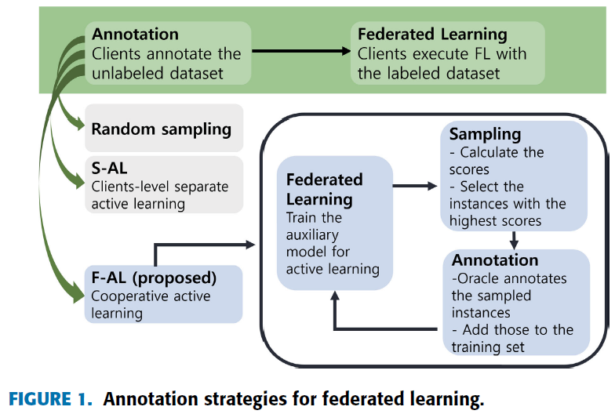
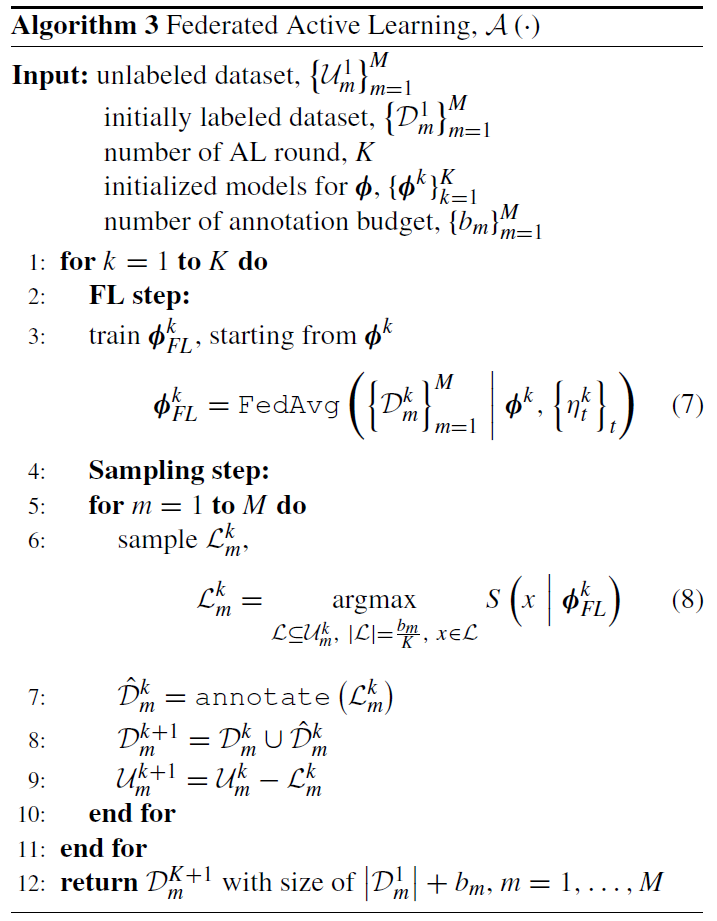

# Federated Active Learning (F-AL): An Efficient Annotation Strategy for Federated Learning

**conference: IEEE**  
**year: 2024**  
**link: [paper](https://ieeexplore.ieee.org/stamp/stamp.jsp?arnumber=10471526)**

## 1. What kind of research

- This research focuses on developing a novel annotation strategy called Federated Active Learning (F-AL) for federated learning (FL) systems.
- The primary objective is to optimize the selection of data instances for annotation in a federated setting, enhancing the performance of FL models while minimizing the annotation cost.

## 2. What makes it great compared to previous studies

- The study addresses a significant gap in FL research, which often assumes perfectly labeled datasets. It integrates AL to reduce annotation workloads, improving both FL and AL performances synergistically.
- The proposed F-AL method demonstrates superior performance over traditional random sampling and client-level separate AL (S-AL) strategies.

## 3. Key points of the technique or method

- **Annotation Strategy**: F-AL utilizes an AL approach tailored for federated settings, focusing on selecting the most informative data instances for annotation to improve the overall model performance.

- **Comparison**: The performance of F-AL is compared against random sampling and S-AL across multiple datasets, showing superior results.

## 4. How it was validated

- The validation of F-AL involved extensive experimentation on three datasets: Fashion-MNIST, CIFAR-10, and CIFAR-100. The researchers conducted multiple rounds of AL, measuring the test accuracy of the FL model at each round. They compared the performance of F-AL with random sampling and S-AL, demonstrating the consistent superiority of F-AL in improving model accuracy with fewer annotated instances.

## 5. Discussion

## 6. Which paper to read next

- ["State-Relabeling Adversarial Active Learning" by Zhang et al. (2020)](https://openaccess.thecvf.com/content_CVPR_2020/papers/Zhang_State-Relabeling_Adversarial_Active_Learning_CVPR_2020_paper.pdf)

## 7. Notes

- The paper provides additional results for scenarios where data distribution among clients is heterogeneous, showing that F-AL still performs better than other strategies.
