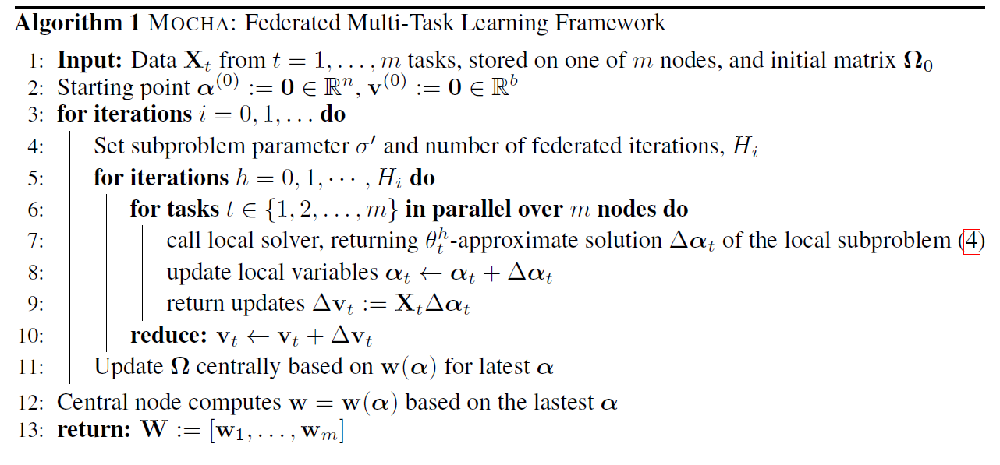

# Federated Multi-Task Learning

**conference: NeurIPS**  
**year: 2017**  
**link: [paper](https://proceedings.neurips.cc/paper_files/paper/2017/file/6211080fa89981f66b1a0c9d55c61d0f-Paper.pdf)**

## 1. What kind of research

- This research presents a novel approach called MOCHA (Multi-Objective Convex Heuristic Algorithm) for federated multi-task learning (FMTL). It addresses the unique statistical and systems challenges inherent in FL environments, where data is distributed across numerous devices with varying capabilities and network conditions.

## 2. What makes it great compared to previous studies

- This study stands out by considering both the statistical and systems challenges of FL simultaneously. Unlike prior work that focuses on training a single global model, MOCHA learns separate models for each node while efficiently handling high communication costs, stragglers, and fault tolerance.
- This dual focus results in significant speedups and robust performance in federated settings compared to traditional multi-task learning methods.

## 3. Key points of the technique or method

- **MOCHA Framework**: The method extends the COCOA framework for distributed optimization to the multi-task setting, incorporating systems challenges unique to FL.
- **Alternating Optimization**: The approach alternates between optimizing for model parameters and the global variable, allowing for efficient distributed computation.

- **Systems-aware Design**: The method accounts for practical issues such as node dropout, varying computation power, and network instability, ensuring robust performance.

## 4. How it was validated

- MOCHA was validated through simulations on real-world federated datasets, such as Google Glass and Human Activity Recognition datasets.
- The results demonstrated its ability to handle the statistical challenges of FL, manage stragglers, and maintain fault tolerance. The robustness of MOCHA was also tested under varying conditions of node dropout, showing that it performs well even with high dropout rates.

## 5. Discussion

- The paper discusses the implications of MOCHA for the FL community, highlighting its ability to address both statistical and systems challenges. The authors note that while MOCHA is designed for convex models, future work could explore its application to non-convex deep learning models. The discussion also points to potential connections between MOCHA and kernelized FMTL, suggesting avenues for further research.

## 6. Which paper to read next

- [“Communication-Efficient Distributed Dual Coordinate Ascent” by Jaggi et al. (2014)](https://proceedings.neurips.cc/paper_files/paper/2014/file/894b77f805bd94d292574c38c5d628d5-Paper.pdf)

## 7. Notes

- The paper uses datasets like Google Glass for activity recognition and Human Activity Recognition from mobile phone sensors.
- Potential applications include mobile user activity prediction, health event forecasting from wearable devices, and smart home security detection.
- The MOCHA code is available at [GitHub](https://github.com/gingsmith/fmtl).
