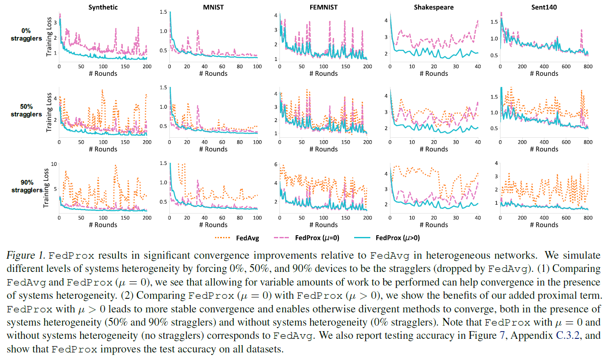

# Federated Optimization in Heterogeneous Networks

**conference: MLSys**  
**year: 2020**  
**link: [paper](https://proceedings.mlsys.org/paper_files/paper/2020/file/1f5fe83998a09396ebe6477d9475ba0c-Paper.pdf)**

## 1. What kind of research

- This paper presents research on federated learning (FL), focusing on optimization methods for heterogeneous networks. The primary contribution is the introduction of a new framework called FedProx, which addresses challenges associated with statistical and system-level heterogeneity in federated networks.

## 2. What makes it great compared to previous studies

- Unlike previous methods such as FedAvg, FedProx provides a more robust solution for FL in heterogeneous environments. It generalizes and re-parameterizes FedAvg, offering theoretical convergence guarantees and practical improvements in robustness and stability. Specifically, it allows for variable amounts of work by participating devices, making it more adaptable to real-world conditions where devices may have differing capabilities.

## 3. Key points of the technique or method

- **FedProx Framework**: It introduces a proximal term to the local objective function, which helps in controlling the divergence of local updates and ensures more stable convergence.
- **γ-inexact solution**: The method allows for inexact solutions of local subproblems, providing flexibility in the amount of local computation versus communication.
- **Dissimilarity Characterization**: The framework uses statistical dissimilarity measures between local functions to analyze convergence behavior.

## 4. How it was validated

- The FedProx framework was validated through both theoretical analysis and empirical experiments. The theoretical validation included proving convergence guarantees under heterogeneous settings. Empirically, it was tested on a suite of realistic federated datasets, showing significant improvements in stability and accuracy compared to FedAvg, especially in highly heterogeneous environments.

## 5. Discussion

- The discussion highlights the importance of addressing both statistical and systems heterogeneity in FL. FedProx's proximal term is crucial for managing the differences in data distribution and computational capabilities of devices.
- The authors also note the potential for combining FedProx with privacy-preserving techniques like differential privacy and secure multiparty communication. They acknowledge that while FedProx offers substantial improvements, there are still open challenges, particularly in further optimizing communication efficiency and handling extreme cases of heterogeneity.

## 6. Which paper to read next

- [“Communication-Efficient Learning of Deep Networks from Decentralized Data” by McMahan et al. (2017)](https://proceedings.mlr.press/v54/mcmahan17a/mcmahan17a.pdf)

## 7. Notes

- **Statistical Heterogeneity**: Refers to the non-identically distributed data across devices.
- **Systems Heterogeneity**: Involves differences in device capabilities such as CPU, memory, and connectivity.
- **Proximal Term**: A key feature in FedProx that helps manage the divergence in local updates.
- The code is available at [GitHub](https://github.com/litian96/FedProx).
