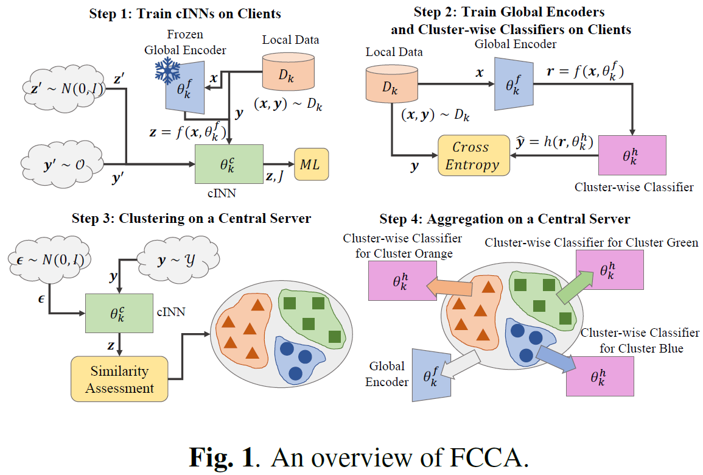

# Federated cINN Clustering for Accurate Clustered Federated Learning

**conference: IEEE**  
**year: 2024**  
**link: [paper](https://ieeexplore.ieee.org/document/10447282)**

## 1. What kind of research

- This research presents a novel federated learning (FL) method named Federated cINN Clustering Algorithm (FCCA). It addresses the challenges of data heterogeneity in FL by clustering clients based on their data distributions to improve the performance of the global model.

## 2. What makes it great compared to previous studies

- **Innovative Clustering Approach**: Unlike previous clustered FL methods, FCCA does not rely on previous clustering solutions, reducing error propagation through training iterations.
- **Privacy Preservation**: It uses a conditional Invertible Neural Network (cINN) to encode client data, ensuring privacy and preventing mode collapse.
- **Generative Model Utilization**: Employs a generative model for maximum likelihood estimation, enhancing optimization.

## 3. Key points of the technique or method

- **Global Encoder**: Transforms each client’s private data into multivariate Gaussian distributions.
- **Conditional Invertible Neural Network (cINN)**: Learns encoded latent features through maximum likelihood estimation to avoid mode collapse.
- **Similarity Assessment and Clustering**: The central server collects converged local models and partitions them into distinct clusters based on approximated similarities.

## 4. How it was validated

- The algorithm was validated through extensive experiments on various datasets, demonstrating its superiority over state-of-the-art clustered FL algorithms. The performance improvements were measured in terms of clustering accuracy and overall model performance.

## 5. Discussion

- The paper discusses the efficiency and accuracy of the FCCA in real-world FL tasks. It highlights the robustness of the method against data heterogeneity and emphasizes the importance of accurate clustering in improving FL performance.

## 6. Which paper to read next

- [“Guided Image Generation with Conditional Invertible Neural Networks” by Ardizzone et al. (2019)](https://hci.iwr.uni-heidelberg.de/vislearn/HTML/publications/papers/2019/ardizzone2019guided.pdf)

## 7. Notes
