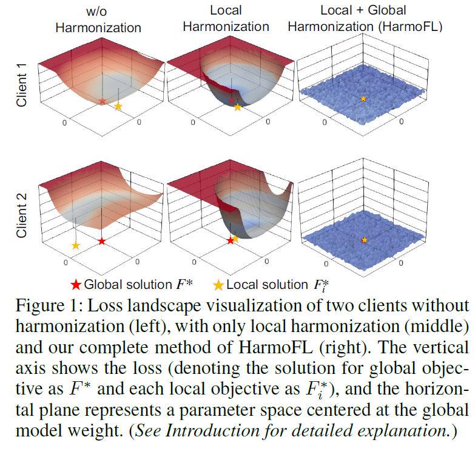

# HarmoFL: Harmonizing Local and Global Drifts in Federated Learning on Heterogeneous Medical Images

**conference: AAAI**  
**year: 2022**  
**link: [paper](https://cdn.aaai.org/ojs/19993/19993-13-24006-1-2-20220628.pdf)**

## 1. What kind of research

- This paper presents research in the field of federated learning (FL), specifically addressing the challenges posed by non-independent and identically distributed (non-iid) data in heterogeneous medical imaging datasets.
- The study introduces a novel approach, HarmoFL, designed to harmonize local and global drifts to improve the performance and stability of FL models.

## 2. What makes it great compared to previous studies

- HarmoFL significantly outperforms state-of-the-art (SOTA) methods by addressing both local and global drifts, which are common issues in FL with non-iid data.
- The study demonstrates significant improvements in accuracy and robustness on non-iid datasets such as breast cancer histology image classification, histology nuclei segmentation, and prostate MRI segmentation.

## 3. Key points of the technique or method

- **Harmonizing Strategy:** HarmoFL introduces a strategy to reduce both local and global drifts. This is achieved by ensuring the representations of client models are better aligned, despite heterogeneous data distributions.

- **Model Architecture:** The study uses models such as DenseNet121 and U-Net for different tasks, trained with varying communication frequencies and optimization settings.
- **Performance Metrics:** The technique is validated through classification and segmentation tasks, demonstrating superior performance in terms of accuracy and Dice coefficients.

## 4. How it was validated

- The validation involved extensive experiments on several medical imaging tasks:
    - **Breast Cancer Histology Image Classification:** Using the Camelyon17 dataset, the method was trained and evaluated across five clients with heterogeneous images.
    - **Histology Nuclei Segmentation:** Utilizing datasets such as MoNuSAC2020, the method was tested on data divided into six clients.
    - **Prostate MRI Segmentation:** Evaluated on a multi-site prostate segmentation dataset with six clients. The results showed higher performance and stable convergence compared to other methods.
- Performance metrics included accuracy and Dice coefficient, with comparisons against state-of-the-art FL methods like FedAvg, FedBN, FedProx, FedNova, FedAdam, and MOON.

## 5. Discussion

- The discussion highlights the effectiveness of HarmoFL in managing heterogeneous data distributions, leading to improved model performance across different medical imaging tasks.
- The study also emphasizes the method's ability to maintain low variance in testing accuracy across clients, demonstrating its robustness and reliability. The ablation study further supports the contributions of HarmoFL by analyzing convergence, local update epochs, and weight perturbation effects

## 6. Which paper to read next

- [“Adaptive Federated Optimization” by Reddi et al. (2021)](https://openreview.net/pdf?id=LkFG3lB13U5)

## 7. Notes

- The study effectively combines theoretical advancements with practical validation on real-world datasets.
- It provides a comprehensive analysis of the FL process, focusing on harmonizing strategies to address non-iid data challenges.
- The results indicate substantial improvements in FL performance, suggesting potential applications in diverse medical imaging tasks.
