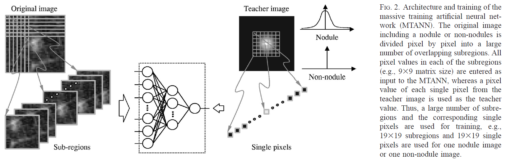
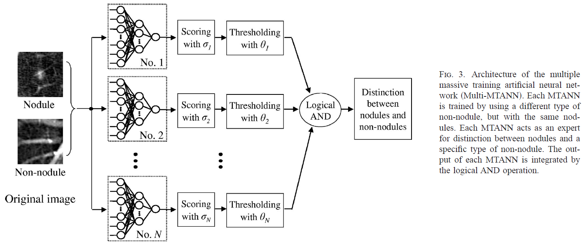
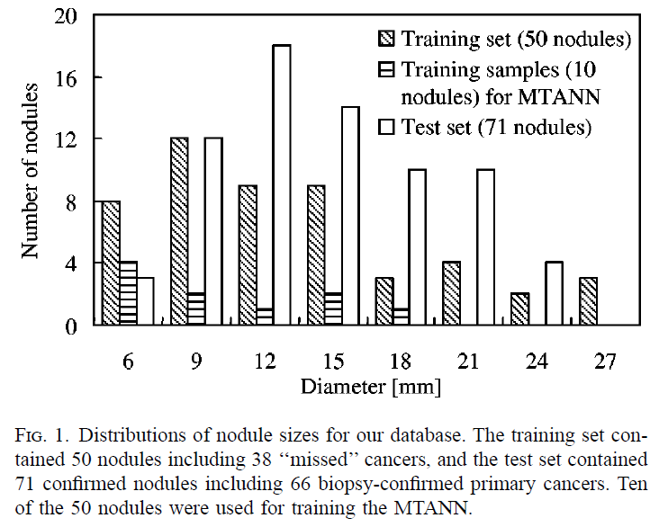

# Massive Training Artificial Neural Network (MTANN) for Reduction of False Positives in Computerized Detection of Lung Nodules in Low-Dose Computed Tomography

**journal: Medical Physics**  
**year: 2003**  
**link: [paper](https://suzukilab.first.iir.titech.ac.jp/ja/wp-content/uploads/2020/01/SuzukiEtAl-MedPhy2003-7-MTANN-LDCT.pdf)**

## 1. What kind of research

- This study focuses on the development of a computer-aided detection (CAD) scheme utilizing a Massive Training Artificial Neural Network (MTANN) to reduce the number of false positives in the automated detection of lung nodules in low-dose computed tomography (CT) scans.

## 2. What makes it great compared to previous studies

- The innovative aspect of this research lies in its use of MTANN, which is a more advanced pattern-recognition technique compared to previous methods. This approach specifically aims to address and significantly reduce the false positives which have been a major limitation in earlier CAD systems.

## 3. Key points of the technique or method

- **MTANN Structure**: The MTANN is trained with a large number of samples to differentiate between nodules and non-nodules.

- **Training**: The training set includes LDCT scans with both nodules and false positives identified by radiologists.
- **Scoring**: The MTANN assigns a score to each candidate nodule, which is used to distinguish true nodules from false positives.
- **Combination of Outputs**: The outputs of Multi-MTANNs are combined using a logical AND operation to ensure that no nodules are missed while eliminating false positives as much as possible.

## 4. How it was validated

- The validation involved a database of 101 LDCT scans from 71 patients. The study used 38 scans for training and the rest for testing. The effectiveness of the MTANN in reducing false positives was evaluated by comparing the results with those of traditional CAD systems.

## 5. Discussion

- The MTANN showed significant promise in reducing the number of false positives without compromising sensitivity. This balance is crucial for the practical implementation of CAD systems in clinical environments. The study also discusses the importance of further improving the technique and exploring its applications in other areas of medical imaging.

## 6. Which paper to read next

## 7. Notes

- The study emphasizes the potential of MTANN in improving CAD systems by effectively reducing false positives.
- Future work should focus on enhancing the MTANN technique and extending its application to other diagnostic challenges in medical imaging.
