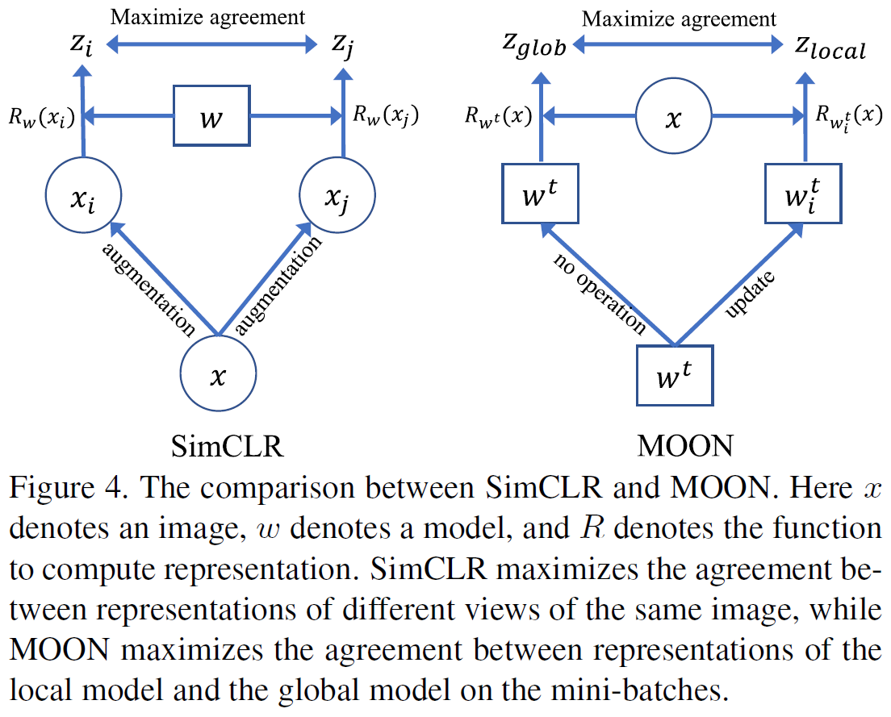
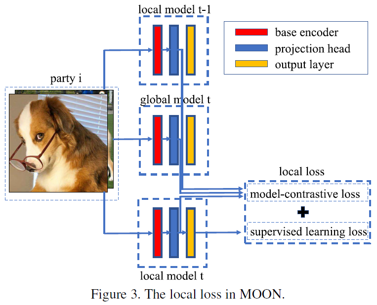

# Model-Contrastive Federated Learning

**conference: CVPR**  
**year: 2021**  
**link: [paper](https://openaccess.thecvf.com/content/CVPR2021/papers/Li_Model-Contrastive_Federated_Learning_CVPR_2021_paper.pdf)**

## 1. What kind of research

- The paper presents a study on federated learning, specifically addressing the challenge of data heterogeneity across different parties. It introduces a novel federated learning framework called MOON (Model-Contrastive Federated Learning).

## 2. What makes it great compared to previous studies

- Unlike traditional federated learning methods which struggle with non-IID (non-identically distributed) data, MOON effectively addresses this issue by using model-contrastive learning to enhance the local training of individual parties. This leads to significantly better performance on image classification tasks compared to other state-of-the-art federated learning algorithms.

## 3. Key pints of the technique or method

- MOON incorporates a contrastive learning approach at the model level rather than the image level. MOON reduces the distance between local and global model representations and increases the distance between the current and previous local model representations.
- The local training objective in MOON includes a standard supervised loss and a model-contrastive loss, which ensures that the local model aligns better with the global model while diverging from its previous local version.

## 4. How it was validated

- The effectiveness of MOON was validated through extensive experiments on various image classification datasets, including CIFAR-10, CIFAR-100, and Tiny-Imagenet. MOON demonstrated superior performance, often exceeding the accuracy of existing methods by at least 2%.

## 5. Discussion

- The paper discusses how MOON's approach of model-contrastive learning addresses the data heterogeneity issue more effectively than previous methods like FedProx and SCAFFOLD, which have shown limited performance improvements on non-IID data with deep learning models.
- It highlights that MOON's improvements are particularly significant in challenging settings, such as achieving a top-1 accuracy of 61.8% on CIFAR-100 with 100 parties, compared to the best existing accuracy of 55%.

## 6. Which paper to read next

- ["Federated Optimization in Heterogeneous Networks" by Li et al. (2020)](https://proceedings.mlsys.org/paper_files/paper/2020/file/1f5fe83998a09396ebe6477d9475ba0c-Paper.pdf)
- ["SCAFFOLD: Stochastic Controlled Averaging for Federated Learning" by Karimireddy et al. (2020)](https://proceedings.mlr.press/v119/karimireddy20a/karimireddy20a.pdf)
- [“A Simple Framework for Contrastive Learning of Visual Representations” by Chen et al. (2020)](https://proceedings.mlr.press/v119/chen20j/chen20j.pdf)

## 7. Notes

- The paper emphasizes the novel perspective of model-level contrastive learning, marking a significant departure from traditional image-level contrastive learning techniques.
- It also suggests potential future work, including comparisons with other contemporary methods and applications of MOON to other types of data beyond image classification.
- The MOON code is available at [GitHub](https://github.com/QinbinLi/MOON).
