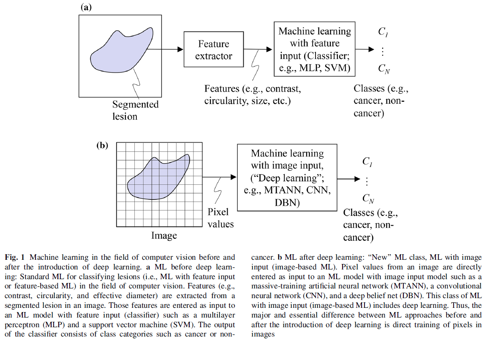
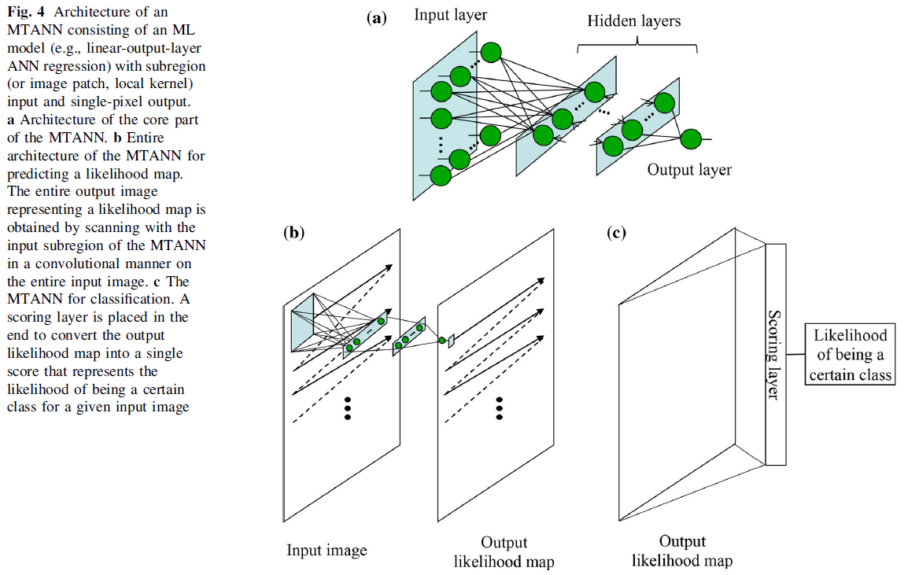
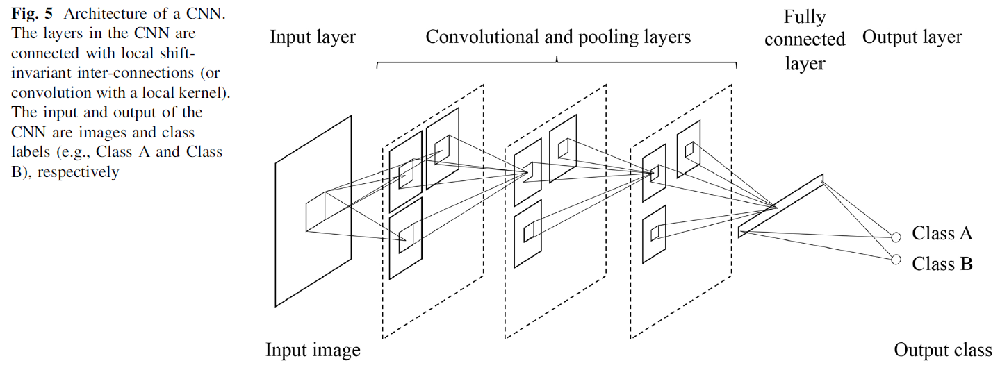

# Overview of Deep Learning in Medical Imaging

**journal: Radiological Physics and Technology**  
**year: 2017**  
**link: [paper](https://suzukilab.first.iir.titech.ac.jp/ja/wp-content/uploads/2020/01/SuzukiK_OverviewDeepLearningMedImag_RPT2017-1.pdf)**

## 1. What kind of research

- The paper provides a comprehensive overview of the application of deep learning in medical imaging. It examines the evolution of machine learning techniques, particularly focusing on how deep learning has revolutionized the field of medical imaging.
- The study explores the strengths and weaknesses of different deep learning models, such as Massive-Training Artificial Neural Networks (MTANNs) and Convolutional Neural Networks (CNNs), and their applications in detecting and diagnosing medical conditions from imaging data.

## 2. What makes it great compared to previous studies

- Unlike traditional machine learning methods that rely on feature extraction and segmentation, deep learning models can process raw pixel data directly. This ability reduces errors associated with feature extraction and segmentation, leading to higher performance in medical image analysis.

- Additionally, the paper provides a detailed comparison of various deep learning models, demonstrating their superiority in terms of accuracy and efficiency in medical imaging tasks.

## 3. Key pints of the technique or method

- **MTANNs**: These networks require fewer training images (e.g., around 20) and complete training faster with GPU implementation, taking a few hours. They have a simpler architecture compared to deep CNNs.

- **CNNs**: These networks use raw pixel data for training and require a large number of training images (e.g., around 1,000,000). Training can take several days. They are effective for high-dimensional data and have been successful in various image classification tasks.

## 4. How it was validated

- The validation of the discussed techniques involved extensive comparison experiments. For instance, the performance of MTANNs and various well-known CNNs (e.g., AlexNet, LeNet) was compared in detecting and classifying lung nodules in CT scans. These experiments used the same databases to ensure fair comparison. The results showed that MTANNs outperformed the best-performing CNN in terms of both false positives and the area under the receiver-operating-characteristic curve (AUC).

## 5. Discussion

- The paper discusses the implications of the shift from feature-based machine learning to deep learning in medical imaging. It highlights the advantages of deep learning, such as higher accuracy and the elimination of errors from segmentation and feature extraction.
- The discussion also addresses the computational challenges and the need for large datasets in training deep learning models.
- Furthermore, the paper anticipates that deep learning will continue to be the mainstream technology in medical imaging, driving advancements in the field.

## 6. Which paper to read next

- [“Massive Training Artificial Neural Network for Reduction of False Positives in Computerized Detection of Lung Nodules in Low Dose Computed Tomography” by Suzuki et al. (2003)](https://suzukilab.first.iir.titech.ac.jp/ja/wp-content/uploads/2020/01/SuzukiEtAl-MedPhy2003-7-MTANN-LDCT.pdf)

## 7. Notes
