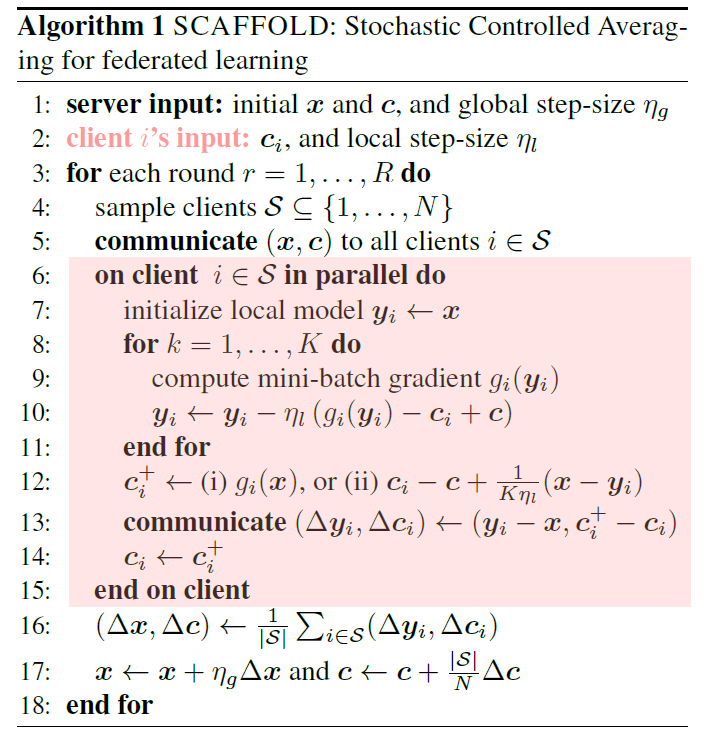

# SCAFFOLD: Stochastic Controlled Averaging for Federated Learning

**conference: PMLR**  
**year: 2020**  
**link: [paper](https://proceedings.mlr.press/v119/karimireddy20a/karimireddy20a.pdf)**

## 1. What kind of research

- This research focuses on federated learning (FL), specifically addressing the challenges of data heterogeneity and communication efficiency. It introduces a new algorithm called SCAFFOLD (Stochastic Controlled Averaging) aimed at improving the performance of FL systems by mitigating client-drift.

## 2. What makes it great compared to previous studies

- The key innovation of SCAFFOLD is its use of control variates to correct client-drift, a significant issue in FL with heterogeneous (non-iid) data.
- Unlike the popular FedAvg algorithm, SCAFFOLD significantly reduces the number of communication rounds required for convergence and is robust to data heterogeneity and client sampling. This leads to more stable and faster convergence compared to previous methods.

## 3. Key points of the technique or method

- **Control Variates:** SCAFFOLD uses control variates to estimate and correct the update direction for both the server and the clients, reducing client-drift.
- **Variance Reduction:** By reducing the variance in client updates, SCAFFOLD achieves faster and more stable convergence.
- **Communication Efficiency:** The algorithm requires fewer communication rounds, making it more efficient in FL scenarios.
- **Adaptability to Data Similarity:** SCAFFOLD can leverage similarities in client data to further enhance convergence speed.

## 4. How it was validated

- The theoretical claims of SCAFFOLD were validated through rigorous mathematical proofs and empirical evaluations. The algorithm's performance was tested on simulated and real datasets, including the extended MNIST dataset. The results confirmed that SCAFFOLD outperforms FedAvg and other baseline algorithms in terms of convergence speed and robustness to data heterogeneity.

## 5. Discussion

- The paper discusses the limitations of FedAvg in handling heterogeneous data and how SCAFFOLD addresses these issues through control variates. It highlights the importance of variance reduction in FL and the advantages of the proposed method in various scenarios.
- The discussion also points out that while SCAFFOLD improves communication efficiency and convergence, there might be further improvements possible in optimizing the algorithm for different types of client data distributions.

## 6. Which paper to read next

## 7. Notes

- The paper emphasizes both theoretical and empirical validation, making it a comprehensive resource for understanding and improving FL systems.
