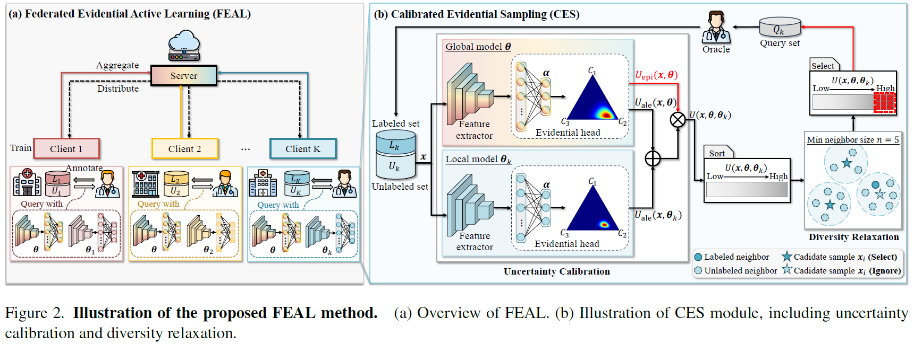

# Think Twice Before Selection: Federated Evidential Active Learning for Medical Image Analysis with Domain Shifts

**conference: CVPR**  
**year: 2024**  
**link: [paper](https://openaccess.thecvf.com/content/CVPR2024/papers/Chen_Think_Twice_Before_Selection_Federated_Evidential_Active_Learning_for_Medical_CVPR_2024_paper.pdf)**

## 1. What kind of research

- This research focuses on improving Federated Learning (FL) for medical image analysis in the presence of domain shifts across different medical institutions.

## 2. What makes it great compared to previous studies

- Unlike previous federated active learning (FAL) methods that assume data from the same domain, this study introduces Federated Evidential Active Learning (FEAL) which accounts for domain shifts. It combines both aleatoric and epistemic uncertainty to provide a more reliable data selection process under domain shift conditions.

## 3. Key pints of the technique or method

- **Dirichlet Prior Distribution:** FEAL uses a Dirichlet-based evidential model to represent the prediction as a distribution over the probability simplex, capturing both types of uncertainties.
- **Calibrated Evidential Sampling (CES):** This method incorporates both uncertainty and diversity measures. It uses epistemic uncertainty to calibrate aleatoric uncertainty and a diversity relaxation strategy to reduce redundancy and maintain diversity.
- **Evidential Model Learning (EML):** Introduces evidence regularization to improve data assessment and representation.
    

    
## 4. How it was validated

- The method was validated through extensive experiments on five multi-center medical image datasets (two for classification and three for segmentation). The results demonstrated FEAL's superiority over existing state-of-the-art FAL methods in scenarios with domain shifts.

## 5. Discussion

- The discussion highlights the advantages of the proposed method in terms of efficiency and accuracy. It addresses potential limitations, such as computational complexity and the need for extensive validation across diverse medical datasets. The study also suggests directions for future research, including optimization of the federated learning process and exploration of other uncertainty estimation techniques.

## 6. Which paper to read next

- ["Federated Active Learning (F-AL): An Efficient Annotation Strategy for Federated Learning" by Ahn et al. (2024)](https://ieeexplore.ieee.org/stamp/stamp.jsp?arnumber=10471526)
- ["Knowledge-Aware Federated Active Learning with Non-IID Data" by Cao et al. (2023)](https://openaccess.thecvf.com/content/ICCV2023/papers/Cao_Knowledge-Aware_Federated_Active_Learning_with_Non-IID_Data_ICCV_2023_paper.pdf)

## 7. Notes

- The study highlights the importance of addressing domain shifts in FAL scenarios, which is common in real-world medical applications. The proposed FEAL method shows significant improvements in handling such shifts, ensuring better model performance and efficient data annotation.
- The FEAL code will be available at [GitHub](https://github.com/JiayiChen815/FEAL).
